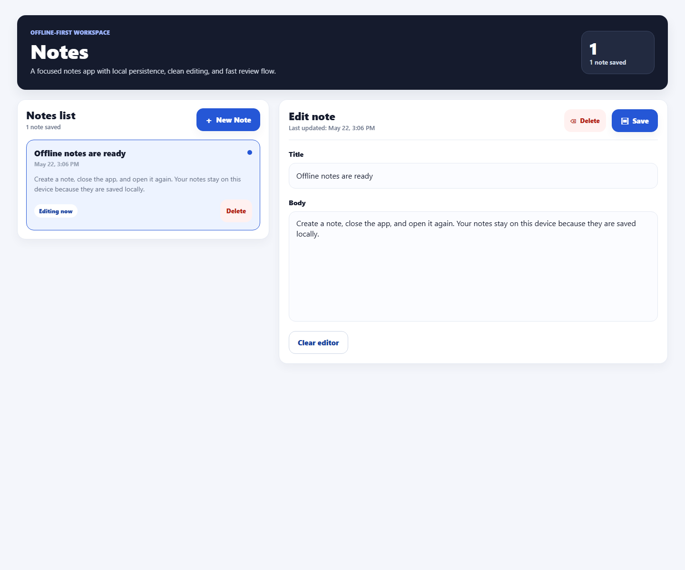

# Offline Notes

Offline Notes is a React Native Expo app for writing and editing notes with local device storage.

## Screenshot



## APK Download

[Download APK from Google Drive](YOUR_GOOGLE_DRIVE_APK_LINK_HERE)

## Features

- Create, edit, and delete notes
- Saves notes locally with AsyncStorage
- Responsive layout for mobile and web
- Works offline after installation

## Run Locally

```bash
npm install
npm start
```
